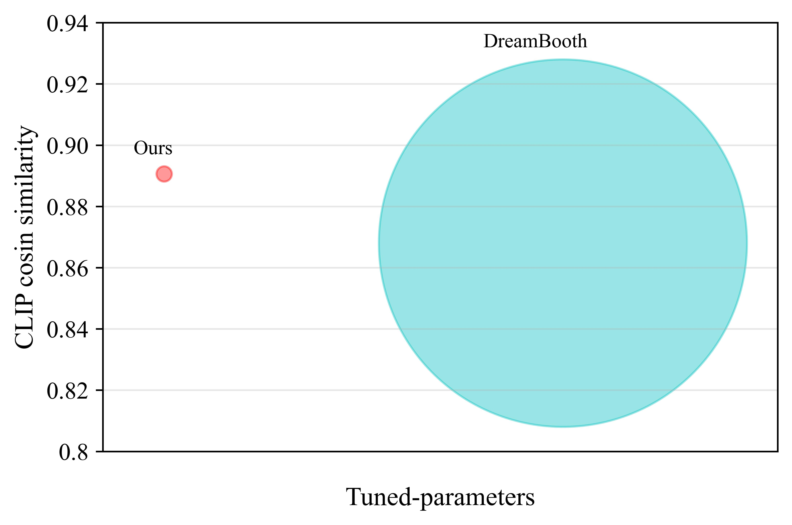
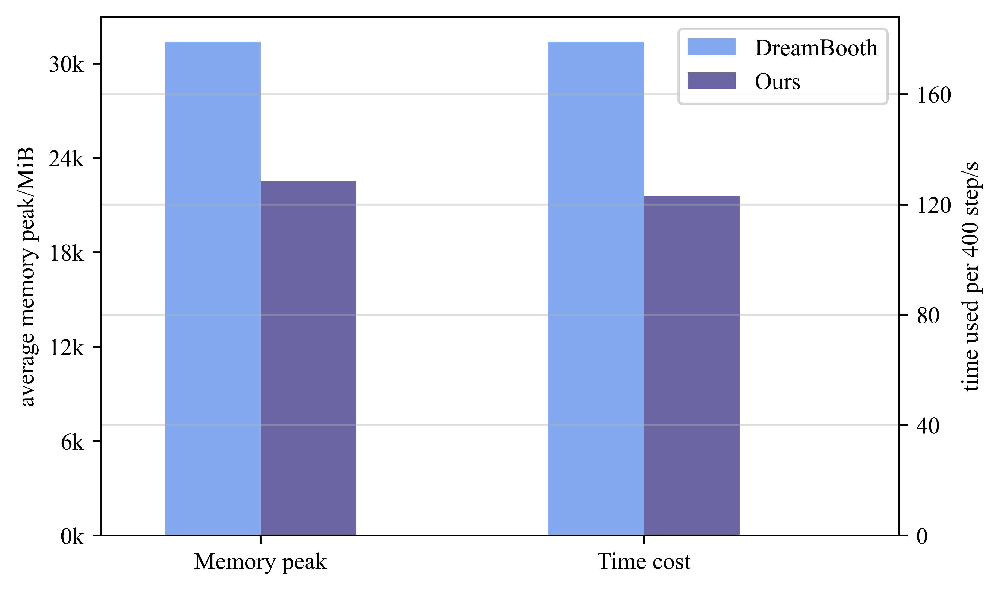
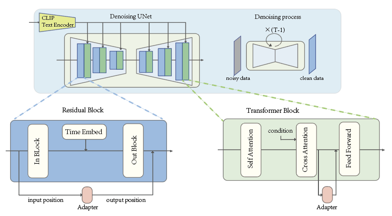
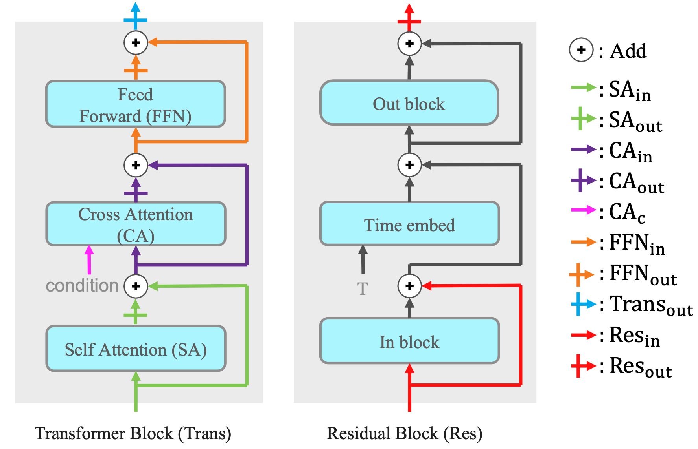
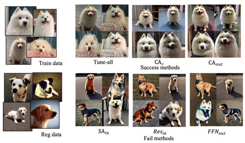

# A Closer Look at Parameter-Efficient Tuning in Diffusion Models

[](https://arxiv.org/abs/2303.18181)

> **A Closer Look at Parameter-Efficient Tuning in Diffusion Models**<br>
> Chendong Xiang<sup>1</sup>, Fan Bao<sup>1</sup>, Chongxuan Li<sup>2</sup>, Hang Su<sup>1,3</sup>, Jun Zhu<sup>1,3</sup> <br>
> <sup>1</sup>TsingHua university, <sup>2</sup>Renmin University of China, <sup>3</sup> Pazhou Lab Guangzhou

>**Abstract**: <br>
> Large-scale diffusion models like Stable Diffusion are powerful and find various real-world applications while customizing such models by fine-tuning is both memory and time inefficient. Motivated by the recent progress in natural language processing, we investigate parameter-efficient tuning in large diffusion models by inserting small learnable modules (termed adapters). 
In particular, we decompose the design space of adapters into orthogonal factors -- the input position, the output position as well as the function form, and perform Analysis of Variance (ANOVA), a classical statistical approach for analyzing the correlation between discrete (design options) and continuous variables (evaluation metrics). 
Our analysis suggests that the input position of adapters is the critical factor influencing the performance of downstream tasks. Then, we carefully study the choice of the input position, and we find that putting the input position after the cross-attention block can lead to the best performance, validated by additional visualization analyses. Finally, we provide a recipe for parameter-efficient tuning in diffusion models, which is comparable if not superior to the fully fine-tuned baseline (e.g., DreamBooth) with only 0.75 % extra parameters, across various customized tasks.


## Description
This repo contains the fixed official code for our paper of **A Closer Look at Parameter-Efficient Tuning in Diffusion Models**. 

Our best setting (attn2o-ffni) could reach comparable if not better results with the fully fine-tuned method within 0.75% extra parameters on both the personalization task introduced in Dreambooth and the task of fine-tuning on a small set of text-image pairs.
 |
--|--


We decompose the design space of adapters into factors of input position, output position, and function form. The input position is where the adapter's input comes from, and the output position is where the adapter's output goes. Function form describes how an adapter transfers the input into the output.

We found that the **input position** of adapters is the critical factor influencing the performance of downstream tasks.



## Notation

We config the adapter as the following formation:

```yaml
adapter_config: 
  transformer_adp_config:  # config adapter for transformer block
    - type: inout # inout is the only valid value
      din: attn1i  # the input position of adapter, 
      # must in  [ "attn1i", "attn1o", "attn2i", "attn2o", "attn2c", "ffni", "ffno", "transo"]

      dout: attn1i # the output position of adapter
      # must in ["attn1i", "attn2i", "ffni", "transo", "attn2c"]

      mid_dim: 60 # the mid dim of adapter, which determid determine the adapter size
      method: "default" # the activate function, default as Relu, must in ["relu", "sig", "silu", "ident", "default"]
      scale: 1.0 # scale factor, which control the impact strength of adapter
 
# when perform adapter in ResBlock in diffusion model, the config form is:
adapter_config: 
  resblock_adp_config:
    type: inout
    din: resi # must in ["resi", "reso"]
    dout: reso # must in ["resi", "reso"]
    method: default
    mid_dim: 7
    scale: 1.0
```


We align notation in paper and code with the following table:

| notation in paper | notation in config | explaination                           |
| ----------------- | ------------------ | -------------------------------------- |
| $SA_{in}$         | attn1i             | input of self-attention layer          |
| $SA_{out}$        | attn2o             | output of self-attention layer         |
| $CA_{in}$         | attn2i             | input of cross-attention layer         |
| $CA_{out}$        | attn2o             | output of corss-attention layer        |
| $CA_{c}$          | attn2c             | context input of cross-attention layer |
| $FFN_{in}$        | ffni               | input of feedforward layer             |
| $FFN_{out}$       | ffno               | output of feedforward layer            |
| $Trans_{out}$     | transo             | output of transformer block            |
| $Res_{in}$        | resi               | input of residual block                |
| $Res_{out}$       | reso               | output of residual block               |

We show the data pathes in a clear way in following graph:



We listed our config files in `configs/sd-inject-dreambooth`, each config file has the name of `<input>-<output>.yaml`.


## Setup

Our code builds on, and shares requirements with [Latent Diffusion Models (LDM)](https://github.com/CompVis/latent-diffusion). To set up their environment, please run:

```
conda env create -f environment.yaml
conda activate ldm
```

We use Stable Diffusion v1.4 as base model. Currently, the model can be downloaded from [Hugging Face](https://huggingface.co/) by running:

```
wget https://huggingface.co/CompVis/stable-diffusion-v-1-4-original/resolve/main/sd-v1-4.ckpt
```


## Usage

### Train

To train an Dreambooth image set with small adapters, run:

```shell
python main_dream_booth.py --base configs/sd-inject-dreambooth/<input>-<output>.yaml  \
               -t  \
               --actual_resume /path/to/pretrained/model.ckpt \
               -n <run_name> \
               --gpus 0, \
               --data_root /path/to/directory/with/train/images \
               --reg_data_root /path/to/Regularization/images \
               --scale_lr False \
                --class_word <class_word> \
                    --logdir  /path/to/logdir
```

### Generation

To generate new images of the learned adapter, run:
```shell
 python sample.py --n_samples 1 --n_iter 1 \
                --scale 7.5   --ddim_steps 20 \
                --ckpt /path/to/ckpt \
                --prompt "a photo of a sks <class_word> " \
                --config "configs/sd-inject-dreambooth/attn1i-attn2i.yaml" \
                --adapter_path "<logdir>/example<time stamp>_<run_name>/checkpoints/999-adapters" \ # path of adpaters
                --outdir outputs
```

where the class word is to describe the general class of train data (e.g., 'toy', 'painting', 'dog').

To run on multiple GPUs, provide a comma-delimited list of GPU indices to the --gpus argument (e.g., ``--gpus 0,3,7,8``)

Trained ckpt and output images will be saved in the log directory.

To get a better understanding of DreamBooth algorithm, please see their [project](https://dreambooth.github.io/).


### load and save adapters

```python
model = load_model_from_config(config, ckpt_path, True)
model.model.diffusion_model.save_adapter_to_dir(adapter_path) # store adapters to dir
model.model.diffusion_model.load_adapter_from_dir(adapter_path) # load adapters from dir
```


## Tips and Tricks
- Results can be seed sensititve. If you're unsatisfied with the model, try re-inverting with a new seed (by adding `--seed <#>` to the prompt).


## Results

We show caces with worked methods and failed methods. All samples are sampled with prompt “a photo of sks dog”.



more detail results, see our [paper](https://arxiv.org/abs/2303.18181).


## Citation

If you make use of our work, please cite our paper:

```
@misc{xiang2023closer,
      title={A Closer Look at Parameter-Efficient Tuning in Diffusion Models}, 
      author={Chendong Xiang and Fan Bao and Chongxuan Li and Hang Su and Jun Zhu},
      year={2023},
      eprint={2303.18181},
      archivePrefix={arXiv},
      primaryClass={cs.CV}
}
```

